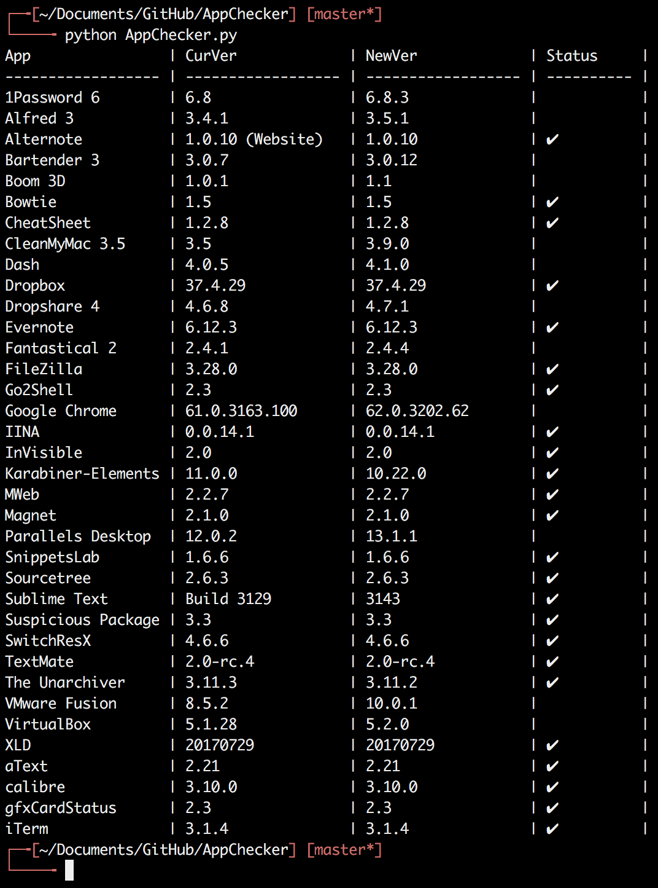

# AppChecker

AppChecker is a program allowing you to check the current version of the application on you Mac computer with the newest version captured from *macupdate.com* based on Python and MongoDB.

# Dependency
This program is written in *Python*, using *MongoDB* to manage the version of your application.
So the dependency will be listed in followed:

* Python
* MongoDB

# Usage
Firstly, you will have to written the *MongoDB* connection configuration stored in *MongoDB.conf* under the run directory.

```
[MongoDB]
db_host = your_host
db_port = your_port
db_name = AppChecker
```
You should replace the *your_host* and *your_port* with your own MongoDB connection host and port.

Then, you can simply run the command

```
python AppChecker.py
```

# Example



